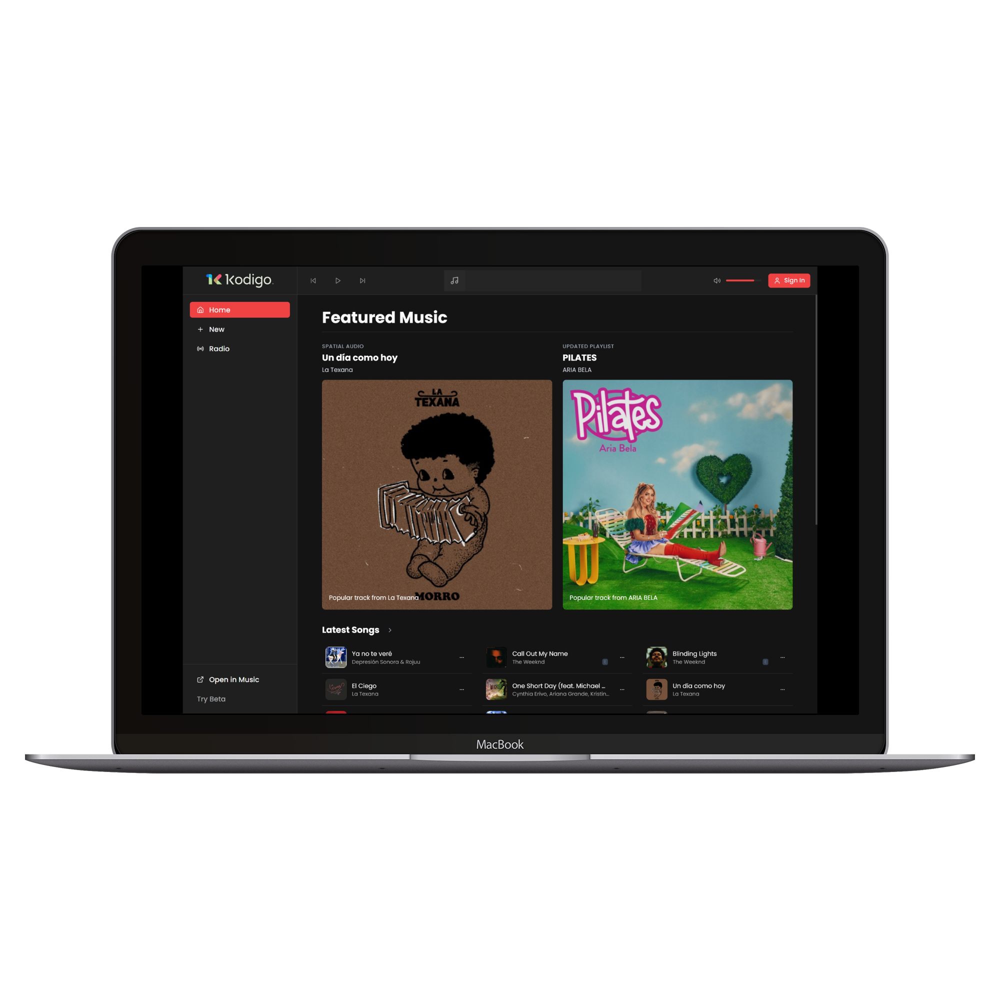
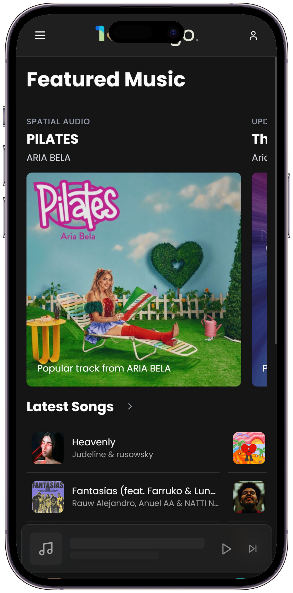

# Kodigo Music 1.0

> A responsive, SPA‑style music platform inspired by Apple Music. Built with React 19, Vite 6, TypeScript & Tailwind CSS.

## 📑 Table of Contents

- [Kodigo Music 1.0](#kodigo-music-10)
  - [📑 Table of Contents](#-table-of-contents)
  - [✨ Features](#-features)
  - [🛠️ Tech Stack](#️-techstack)
  - [📂 Project Structure](#-projectstructure)
  - [⚡ Getting Started](#-gettingstarted)
    - [Prerequisites](#prerequisites)
    - [Installation](#installation)
    - [Development](#development)
    - [Production Build](#productionbuild)
    - [Lint‑all‑the‑things](#lintallthethings)
  - [📦 Available Scripts](#-availablescripts)
  - [🖥️📱 Screenshots](#️-screenshots)
  - [💡 Inspiration \& Thanks](#-inspirationthanks)
  - [📜 License](#-license)

<!-- markdownlint-disable MD022 -->

## ✨ Features

- **Fully Responsive UI** – mobile‑first layouts, custom breakpoints.  
- **Tailwind 4 + tailwind‑merge** – utility‑first styling, className conflict‑free.  
- **Audio Playback** – powered by **howler.js** with volume, seek & playlist support.  
- **Dynamic Color Themes** – on‑the‑fly palette extraction via **node‑vibrant**.  
- **State Management** – lightweight & scalable with **Zustand**.  
- **Forms That Feel Good** – validation & UX via **react‑hook‑form** + **react‑hot‑toast**.  
- **Smooth Carousels / Swipers** – modular **Swiper 11** implementation.  
- **Type‑Safe Everything** – strict TypeScript across hooks, services & mappers.  
- **Component‑Driven** – reusable **cn()**, section wrappers, modals, float bar, etc.  

## 🛠️ Tech Stack

| Layer       | Library / Tool                             | Role                                                |
| ----------- | ------------------------------------------ | --------------------------------------------------- |
| **Core**    | **React 19**, **Vite 6**                   | SPA scaffolding & lightning‑fast HMR                |
| **Styling** | **Tailwind CSS 4**, **clsx**, **tailwind‑merge** | Utility classes & dynamic merging                  |
| **Audio**   | **howler.js**                              | MP3/AAC streaming + controls                        |
| **State**   | **Zustand**                                | Global player & UI state                            |
| **Forms**   | **react‑hook‑form**, **react‑hot‑toast**   | Validation & toast notifications                    |
| **Visuals** | **lucide‑react**, **react‑icons**, **canvas‑confetti** | SVG icons & celebrations                     |
| **Colors**  | **node‑vibrant**                           | Adaptive backgrounds / gradients                    |
| **Routing** | **react‑router‑dom v7**                    | Nested routes & lazy loading                        |
| **Type**    | **TypeScript 5.8**                         | End‑to‑end typing                                   |
| **Linting** | **ESLint 9 + @typescript‑eslint**          | Code standards                                      |

## 📂 Project Structure

```text
src
├── assets
│   ├── images/logo.webp
│   └── react.svg
├── components
│   ├── common/…
│   ├── layout/…
│   ├── music/…
│   └── ui/…
├── data/
├── generators/
├── hooks/
├── pages/
├── repositories/
├── router/
├── services/
├── store/
├── styles/
├── types/
├── utils/
└── main.tsx
```

## ⚡ Getting Started

### Prerequisites

- **Node ≥ 18**
- **pnpm / npm / yarn**

### Installation

```bash
git clone https://github.com/Jimieee/kodigo-music.git
cd kodigo-music
npm install            # or pnpm install / yarn
```

### Development

```bash
npm run dev
# ➜ open http://localhost:5173
```

### Production Build

```bash
npm run build          # tsc -b && vite build
npm run preview        # serves dist/ on http://localhost:4173
```

### Lint‑all‑the‑things

```bash
npm run lint
```

## 📦 Available Scripts

| Script    | Purpose                                |
| --------- | -------------------------------------- |
| `dev`     | Start Vite dev‑server with HMR         |
| `build`   | Type‑check & generate optimized build  |
| `preview` | Serve production build locally         |
| `lint`    | Run ESLint                             |

## 🖥️📱 Screenshots

| Desktop | Mobile |
| ------- | ------ |
|  |  |

## 💡 Inspiration & Thanks

- UI/UX cues from **Apple Music**.  
- Iconography by **Lucide** & **react‑icons**.  
- Typography **Poppins**.
- Confetti magic courtesy of **canvas‑confetti**.  
- Color extraction love to **node‑vibrant**.  

## 📜 License

Distributed under the **MIT License**.  
See [`LICENSE`](LICENSE) for more information.

---

> Crafted with ❤️  by **Jimieee**  
